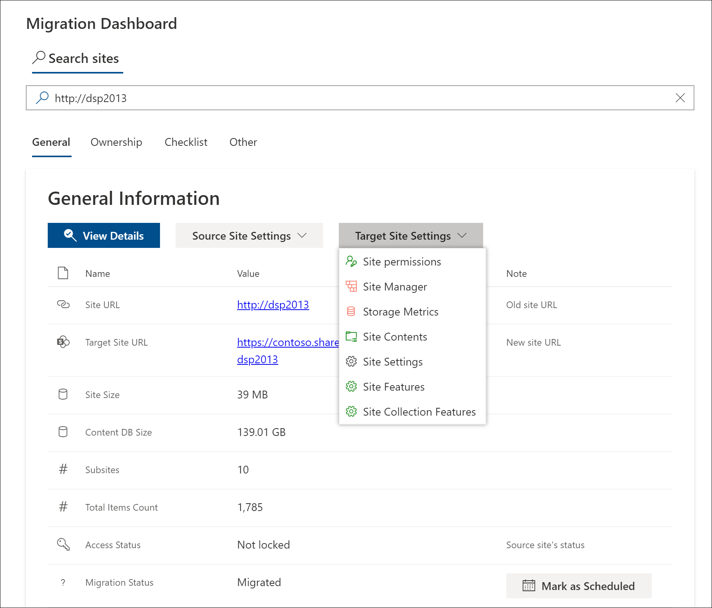

# SharePoint Migration Dashboard
Planning to migrate your SharePoint server farm to SharePoint Online? Then you absolutely must install this dashboard.

## Reasons for Setting up the Migration Dashboard

 - SharePoint migrations to Microsoft 365 can be a nightmare to plan and organize
 - You want to keep track of your migration progress
 - Dashboard is a self-service portal designed to provide SharePoint site owners with all migration-related questions
 - Save time on reading [SharePoint Migration Assessment Tool (SMAT)](https://www.microsoft.com/en-us/download/details.aspx?id=53598&WT.mc_id=rss_alldownloads_all) reports. Migration Dashboard presents SMAT data in a human readable form that will be available both for the migration team and site owners.



## Deploy Migration Dashboard

### Prerequisites

- Microsoft 365 subscription
- SharePoint Online Administrator role (for creating the App Catalog)
- SharePoint Site Administrator (for deploying the package)
- [SharePoint App Catalog](https://docs.microsoft.com/en-us/sharepoint/use-app-catalog)

### Deployment steps

1. Download the and unzip [latest release](https://github.com/Zerg00s/sp-migration-dashboard/releases/download/1.0/sp-migration-dashboard.Release.zip)
1. Run `Install-Module SharePointPnPPowerShellOnline` in PowerShell
1. Navigate to \PowerShell\ Folder and run `Prerequisites.bat`
1. [Create App Catalog Site Collection](https://docs.microsoft.com/en-us/sharepoint/use-app-catalog#step-1-create-the-app-catalog-site-collection) in SharePoint Online if not created
1. Navigate to the SharePoint App catalog
1. Drag and drop the `sp-migration-dashboard.sppkg` file to the app catalog's folder


1. Deploy `sp-migration-dashboard.sppkg` app to App Catalog.
1. In SharePoint Online: 
   * Create an empty site collection for hosting Migration Dashboard.
   * Add the "Migration Dashboard" app to this site collection.

   
   * Add Migration Dashboard webpart to the home page.

   
   * Deploy Lists and Libraries by running `Deploy-Dashboard.ps1`


#### Populate the dashboard with the SMAT reports

1. Download [SharePoint Migration Assessment Tool (SMAT)](https://www.microsoft.com/en-us/download/details.aspx?id=53598&WT.mc_id=rss_alldownloads_all)
1. Run SMAT in one of the SharePoint servers in your farm.
1. Run `Upload_SMAT_Reports.ps1` to upload SMAT reports to the Dashboard site.
1. Enjoy the data provided by the Migration Dashboard!

## Architecture

The Dashboard is a lightweight solution that includes the following components
- Communication SharePoint site.
- SharePoint Framework (SPFx) webpart.
- No heavy dependencies or external APIs.
- Your migration-related data will stay in your SharePoint Online tenant.
- Dashboard does not send any data to the outside world.
- Source code is available in this open source repository.

 ## Compatibility

 
 
 
 


## Build the package
You can always take the [latest release from here](https://github.com/Zerg00s/sp-migration-dashboard/releases/download/1.0/sp-migration-dashboard.Release.zip). But you can also build the package manually.

### Prerequisites

- Install [Node.js LTS 10.x](https://nodejs.org/dist/latest-v10.x/)
- Install gulp by running `npm install gulp -g`

### Build the webpart package

```
npm install
gulp bundle --ship
gulp package-solution --ship
```

Navigate to the folder `\sp-migration-dashboard\sharepoint\solution\` and confirm that the .sppg file is there:


## How the deployed webpart looks like


## Watch a short demo 
[](https://youtu.be/6FwCIA-aaPM)
