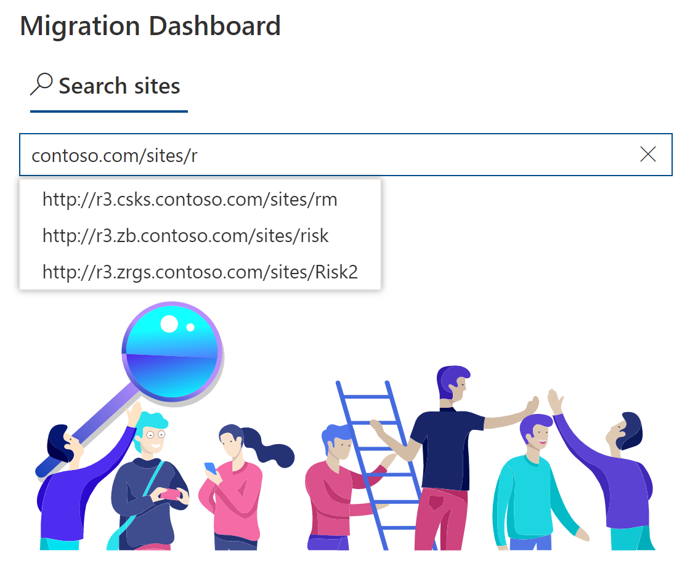

# SharePoint Migration Dashboard
Planning to migrate your SharePoint server farm to SharePoint Online? Then you absolutely must install this dashboard.

## Reasons for Setting up the Migration Dashboard

 - SharePoint migrations to Microsoft 365 can be a nightmare to plan and organize.
 - You want to keep track of your migration progress.
 - Dashboard is a self-service portal designed to provide SharePoint site owners with all migration-related questions.
 - Raw [SharePoint Migration Assessment Tool (SMAT)](https://www.microsoft.com/en-us/download/details.aspx?id=53598&WT.mc_id=rss_alldownloads_all) reports are very hard to analyze. Migration Dashboard presents SMAT data in a human readable form that will be available both for the migration team and site owners.

## Deploy Migration Dashboard

### Prerequisites

- Microsoft 365 subscription
- SharePoint Online Administrator role
- SharePoint App Catalog

### Deployment steps

1. Run `Install-Module SharePointPnPPowerShellOnline` in PowerShell.
1. Navigate to \PowerShell\ Folder and run `Prerequisites.bat`
1. [Create App Catalog Site Collection](https://docs.microsoft.com/en-us/sharepoint/use-app-catalog#step-1-create-the-app-catalog-site-collection) in SharePoint Online if not created.
1. Deploy `sp-migration-dashboard.sppkg` app to App Catalog.
1. In SharePoint Online: 
   * Create an empty site collection for hosting Migration Dashboard.
   * Add the sp-migration-dashboard app to the empty site collection.
   * Add Migration Dashboard webpart to the home page.
   * Deploy Lists and Libraries by running `Deploy-Dashboard.ps1`
1. Download [SharePoint Migration Assessment Tool (SMAT)](https://www.microsoft.com/en-us/download/details.aspx?id=53598&WT.mc_id=rss_alldownloads_all)
1. Run SMAT in one of the SharePoint servers in your farm. 
1. Run `Upload_SMAT_Reports.ps1` to upload SMAT reports to the Dashboard site.
1. Enjoy the data provided by the Migration Dashboard!

## Architecture

The Dashboard is a lightweight solution that includes the following components
- Communication SharePoint site.
- SharePoint Framework (SPFx) webpart.
- No heavy dependencies or external APIs.
- Your migration-related data will stay in your SharePoint Online tenant.
- Dashboard does not send any data to the outside world.
- Source code is available in this open source repository.
 